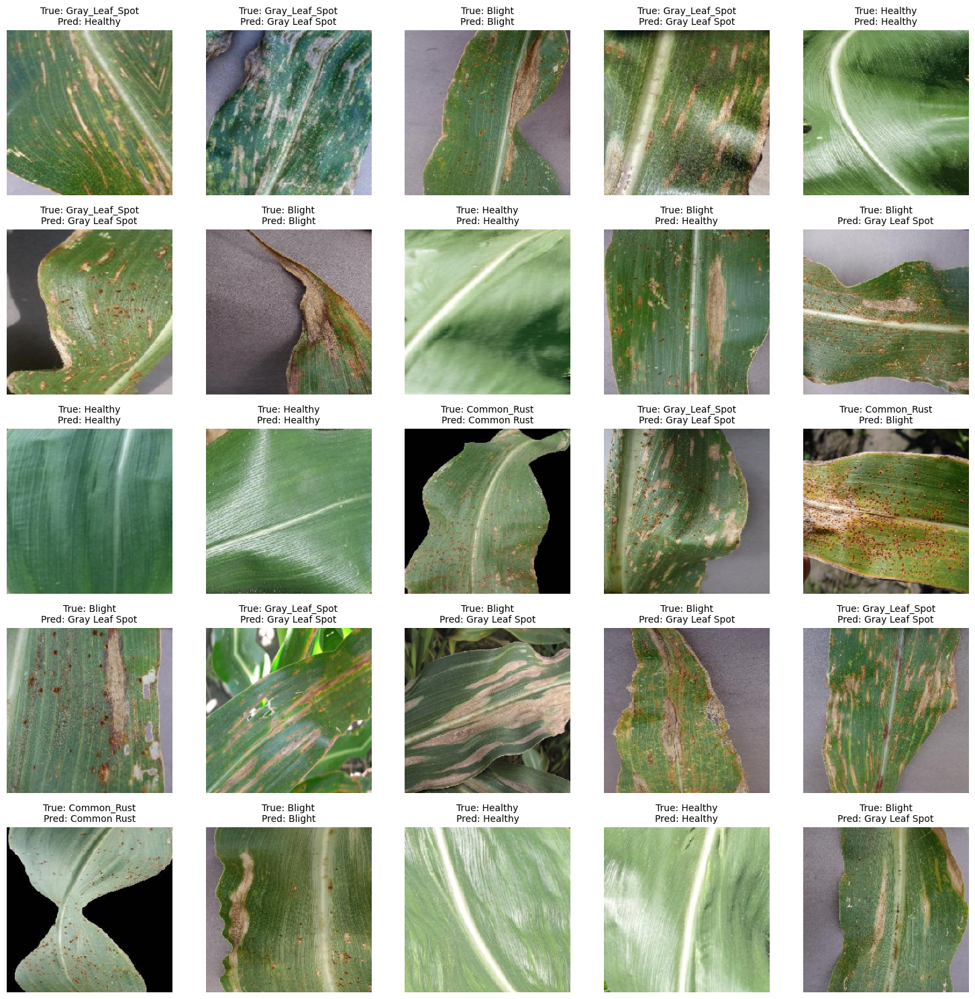
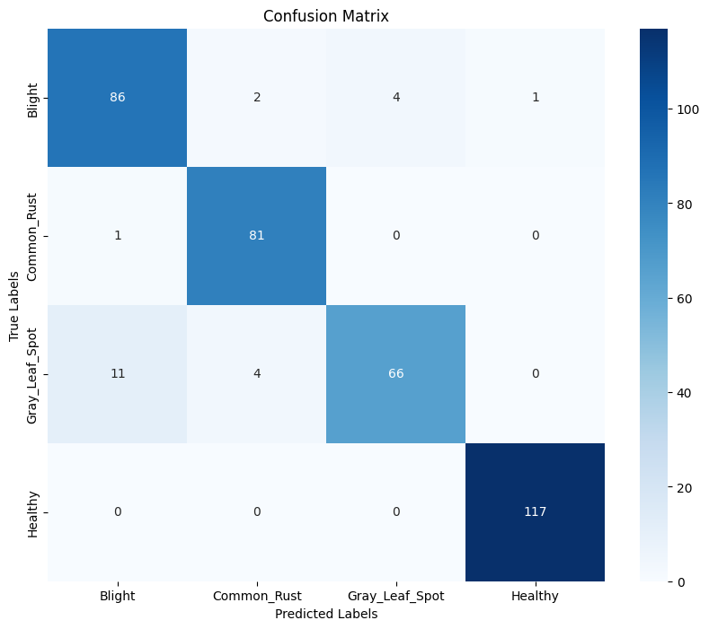
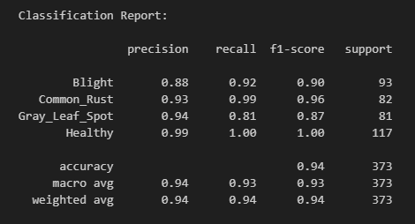

  

<h3 align="center">Corn Disease Detection Based on Leaf Images</h3>

---

 Selamat datang! Proyek ini menggunakan machine learning untuk mendeteksi penyakit pada tanaman jagung berdasarkan gambar daunnya. Tujuannya adalah untuk membantu petani mengidentifikasi penyakit sejak dini dan membantu petani mengambil tindakan untuk meminimalisir kerugian yang disebabkan oleh penyakit pada tanaman jagung.

      

## Dataset
Dataset yang digunakan dalam proyek ini adalah dataset yang telah diambil dari Kaggle. Berikut adalah link datasetnya :
 https://www.kaggle.com/datasets/smaranjitghose/corn-or-maize-leaf-disease-dataset

Sebelum digunakan dataset dibersihkan terlebih dahulu seperti menghapus beberapa gambar yang buram. Sehingga didapatlah dataset seperti berikut:
- Common Rust - 813 images
- Gray Leaf Spot - 409 images
- Blight -928 images
- Healthy - 1162 images

## Features
- Image classification: Menggunakan algoritma Convolutional Neural Network (CNN) dengan arsitektur MobileNetV2 untuk mengklasifikasikan penyakit tanaman jagung berdasarkan gambar daunnya.
- Model deployment: Model ini di-deploy melalui backend Flask yang dikemas dalam Docker kemudian di-deploy menggunakan IBM Cloud Code Engine, sehingga dapat diakses real-time melalui endpoint publik untuk menerima input gambar daun dan memberikan hasil prediksi penyakit.

## Files
- `backend` : Folder yang berisi kode backend yang menggunakan Flask untuk mendefinisikan endpoint API (sudah dilakukan deployment pada IBM Cloud Code Engine).
- `corn_disease` : Folder yang menyimpan dataset yang belum dilakukan augmentasi khusus pada class gray leaf spot.
- `balanced_corn_disease` : Folder yang menyimpan dataset yang sudah dilakukan augmentasi khusus pada class gray leaf spot.
- `split_corn_disease` : Folder yang menyimpan dataset yang sudah dilakukan splitting data menjadi 80% train, 10% val, dan 10% test.
- `split_corn_disease_augmented` : Folder yang menyimpan dataset yang sudah dilakukan augmentasi pada data training.
- `saved_model`: Folder yang menyimpan model yang telah dilatih dan disimpan dalam format h5.
- `requirements.txt` : File yang berisi daftar dependencies yang diperlukan untuk menjalankan proyek ini.
- `corn_disease_detection.ipynb`: File jupyter notebook yang berisi kode untuk melakukan preprocessing data, membuat visualisasi, dan melatih model.

## Model Evaluation
Kami melakukan evaluasi model menggunakan Confusion Matrix dan F1-Score. Model deteksi penyakit tanaman jagung berbasis CNN MobileNetV2 memiliki akurasi 94%. Model ini dirancang untuk mengklasifikasikan empat kelas penyakit: Blight, Common Rust, Gray Leaf Spot, dan Healthy.
- Confusion Matrix:

- F1-Score:

Model CNN dengan arsitektur MobileNetV2 bekerja sangat baik dengan akurasi 94%, khususnya dalam mengklasifikasikan kelas Common Rust dan Healthy dengan akurasi tinggi. Namun, terdapat sedikit kebingungan antara Blight dan Gray Leaf Spot, yang dapat diperbaiki dengan peningkatan kualitas dataset atau augmentasi data.

## Deployment
Model ini telah di-deploy melalui backend Flask yang dikemas dalam Docker. Model ini di-deploy menggunakan IBM Cloud Code Engine, sehingga dapat diakses real-time melalui endpoint publik untuk menerima input gambar daun dan memberikan hasil prediksi penyakit. 

Anda bisa mencoba AI ini melalui fitur deteksi penyakit pada link website berikut : https://smartconweb.my.id/
